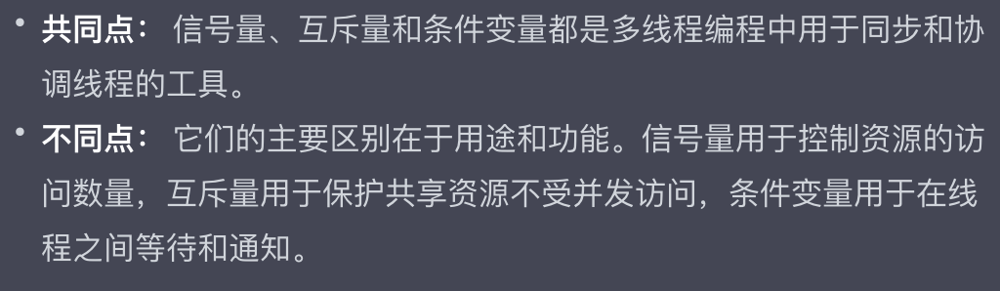

# TinyWebServer - Learning note
#### connect
```bash
ssh -i "/Users/camlostshi/Documents/Codility/project/AWS_EC2_key/SUMMER2023.pem" ubuntu@ec2-18-162-50-109.ap-east-1.compute.amazonaws.com

ssh -i "SUMMER2023.pem" ubuntu@ec2-18-162-50-109.ap-east-1.compute.amazonaws.com

ssh -i "/Users/camlostshi/Documents/Codility/project/AWS_EC2_key/SUMMER2023.pem" ubuntu@ec2-18-166-213-51.ap-east-1.compute.amazonaws.com
```
#### mysql

```bash
ALTER USER 'root'@'localhost' IDENTIFIED WITH mysql_native_password BY '627221';
FLUSH PRIVILEGES;

mysql -u root -p
627221
```

---

As I meet great difficulty in eating the project's code, I think typing while learning might help me a lot.

My target is to <u>clear explain the principle</u> of the project to others and be able to <u>build the project from zero</u> by myself.

I have no idea about the structure of the note. Let me try to scan the code in the most silly way.

## 1 About B/S model

Browser/Server model is a special and specific model of C/S (Client/Server) model.

Three layers: Browser, logic server, database system

## 2 ./lock

It seems operating semaphores. The sem class wrapped thread synchronization mechanism.

```C++
int sem_init(sem_t *sem, int pshared, unsigned int value);
```

Initialize a semaphore with pointer, its type and initial value.

```C++
int sem_destroy(sem_t *sem);
```

```C++
int sem_wait(sem_t *sem); // minus 1 or block
int sem_post(sem_t *sem); // add 1 and awake
```

Mutex locker

```C++
int pthread_mutex_init(pthread_mutex_t *restrict mutex, const pthread_mutexattr_t *restrict attr);
```

```C++
int pthread_mutex_lock(pthread_mutex_t *mutex); // call for resource, if locked, block
int pthread_mutex_unlock(pthread_mutex_t *mutex); // release resource
```

Condition variable

```C++
int pthread_cond_init(pthread_cond_t *cv, const pthread_condattr_t *cattr); 
int pthread_cond_wait(pthread_cond_t *cv, pthread_mutex_t *mutex);// call for a cond, protected by a mutex
int pthread_cond_signal(pthread_cond_t *cv); // release a thread
int pthread_cond_timedwait(pthread_cond_t *cv, pthread_mutex_t *mp, const structtimespec * abstime);
int pthread_cond_broadcast(pthread_cond_t *cv); // release all thread
```

信号量、互斥量、条件变量异同？



实现它们的具体系统调用也不同。

## 3 ./sqlConnectionPool

Using "mysql/mysql.h": a third-party library from MySQL.

Use sem, lock, cond to protect the procedure of getting and releasing connection.

Wrap contructor in static public function and set it as private function, realized Singleton Pattern.

Initialize once with `init()` explicitly.

## 4 ./threadpool

```C++
int pthread_create(pthread_t *thread,const pthread_attr_t *attr,void *(*start_routine) (void *),void *arg);
int pthread_join(pthread_t tid, void ** pthread_return);// wait and withdraw
int pthread_detach(pthread_t tid);// don't wait but release at endding
```


---


2023.8.22：

在大型项目上工作过之后回来看确实有些不一样的感悟。本质上还是不存在所谓的从零开始写一个东西的，找到关节将其剖开，它实际上还是对一些现有的库函数进行调用。于是，要看的重点便在于：用了哪些库函数，以及设计了什么样的数据结构，用的最核心的是哪些模型、哪些思想，这么做是为了什么。看明白这些就可以将这个项目写进简历了。

在这之后就是看看下一个项目该选什么，把js八股好好看看背背，改出简历就能投cpp和前端了。

不要忘记目标：留华为-保一份工作-成为技术大牛寻求精彩人生


---


## 5 ./timer

## 6 ./httpConn

